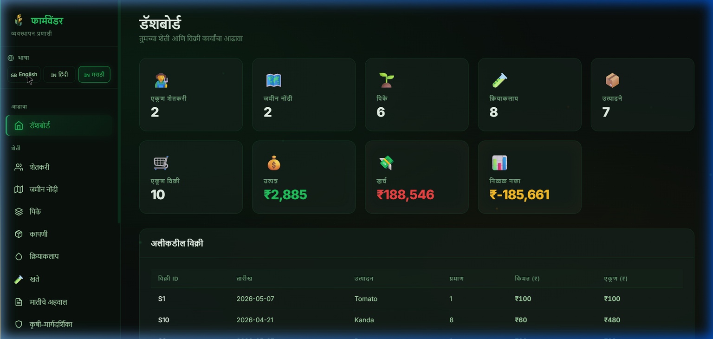
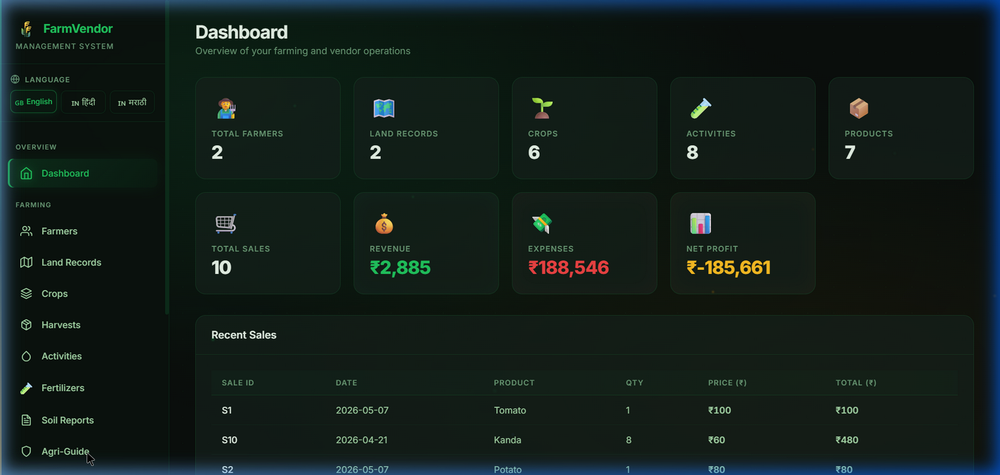
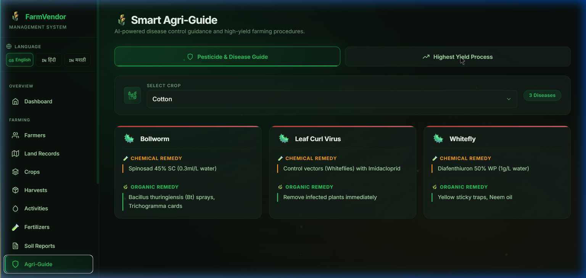
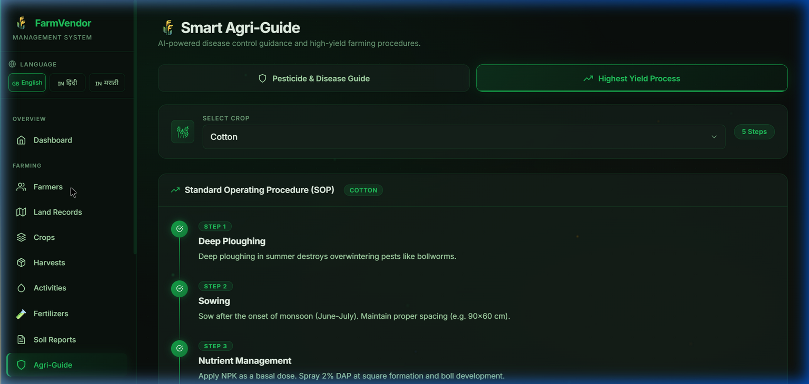

# 🌾 FarmVendor — Patch Notes

---

## v2.0.0 — Smart Agri-Guide Update
**Released:** April 28, 2026

> A major feature drop bringing AI-powered agricultural intelligence, a polished Smart Agri-Guide module, enhanced multi-language support, and significant UI improvements across the entire platform.

---

## 👥 Team & Collaborators

| Role | GitHub |
|------|--------|
| Lead Developer | [@PRASH2005-project24](https://github.com/PRASH2005-project24) |
| Collaborator | [@omie-byte](https://github.com/omie-byte) |

Special thanks to **@omie-byte** for their collaborative contributions to this project. 🙌

---

## 🌟 What's New — AgriGuide

### 🌾 Smart Agri-Guide Module (New Feature)
AgriGuide is a brand-new intelligent knowledge module built into FarmVendor that acts as a **digital agronomist** for farmers. It provides two core functionalities:

#### 🛡️ Pesticide & Disease Guide
- Browse **crop-specific pest and disease information** in a clean card layout
- Each disease card displays:
  - **🧪 Chemical Remedy** — industry-standard pesticide recommendations with dosage references
  - **🌿 Organic Remedy** — eco-friendly, chemical-free alternatives for sustainable farming
- Dynamically loads from the backend for crops: Cotton, Sugarcane, Wheat, Rice, and more
- Real-time disease count badge per crop selection

#### 📈 Highest Yield Process (SOP)
- Interactive **Standard Operating Procedure timeline** per crop
- Step-by-step farming calendar covering: Land Preparation → Sowing → Fertilization → Irrigation → Pest Control → Harvesting
- Each step is numbered with a glowing progress bubble and connector timeline

#### 🌐 Full Multi-Language Support
AgriGuide is now **fully translated** into:
- 🇬🇧 English
- 🇮🇳 Hindi (हिंदी)
- 🟠 Marathi (मराठी)

---

## 📸 Screenshots

### Dashboard


### AgriGuide — Pesticide & Disease Guide


### AgriGuide — Highest Yield Process (SOP Timeline)


### Farmers Management


---

## ✨ Other Improvements in v2.0.0

### UI / Design Overhaul
- **Premium Tab Switcher** — Active tab has glowing green border with animated underline
- **Smart Crop Selector** — Custom dropdown with wheat icon, live crop badge count
- **Disease Cards** — Red gradient top accent bar, proper padded remedy sections with left-border indicators
- **SOP Timeline** — Vertical timeline with glowing step bubbles and gradient connector lines
- Consistent use of the glassmorphism design language across all new components
- Full responsive layout — works perfectly on mobile and tablet

### Frontend Enhancements
- New pages: `AgriGuide`, `Activities`, `LandingPage`, `Market`, `Notifications`, `SoilReports`, `Fertilizers`
- Improved `Farmers`, `Harvests`, `Land`, `Reports`, `Dashboard` pages
- `Toast.jsx` — Non-intrusive global glassmorphic notification system
- Expanded translations: 50+ new keys added for Hindi and Marathi

### Backend (Flask)
- New routes: `/guide/disease`, `/guide/process`, `/notifications`, `/smart-suggestions/<id>`, `/soil-reports`, `/fertilizers`, `/market`
- Enhanced smart suggestion engine using ROI-based crop analysis
- Improved SQL query structure and error handling

### Database
- Extended `setup_db.sql` with fertilizer dosage records, soil report schema, market/exporter table, notifications table
- Additional triggers and stored procedures

---

## 🔧 How to Run

```bash
# Backend
cd backend && python app.py

# Frontend
cd frontend && npm install && npm run dev
```

Open: `http://localhost:5173`

---

## 🔮 Coming Next
- Weather API integration for real-time crop advisories
- Live mandi market price feeds
- Mobile app (React Native)

---

*FarmVendor — Bridging traditional agriculture with modern data intelligence.*
